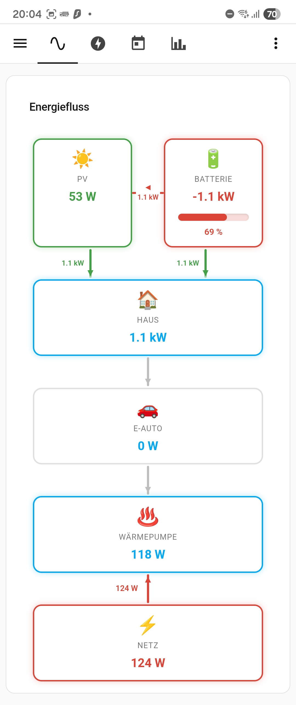

# Flow Cascade Card

A Home Assistant Lovelace card for **energy flow visualization** with support for parallel nodes (PV + Battery side-by-side) and linear cascade distribution.



```
☀️  PV  ──────────→  🔋 Batterie
  ↓ (Direkt)              ↓ (Entladung)
        🏠  Haus
              ↓
        🚗  E-Auto
              ↓
        ♨️  Wärmepumpe
              ↓
        ⚡  Netz
```

## Features

- **Parallel rows** (`layout_row`): PV und Batterie nebeneinander, horizontal animierter Ladepfeil
- **One-way links** (`one_way: true`): Pfeil nur in einer Richtung (z.B. PV→Batterie nie rückwärts)
- Animated directional arrows with watt values
- Bidirectional nodes (battery charge/discharge, grid import/export)
- Battery SOC bar + turquoise at 100 % (cell balancing)
- Configurable via YAML (nodes + links)
- Visual YAML editor in Lovelace UI
- HACS compatible

## Installation

### HACS (recommended)

1. Add as custom repository: `pcdc89/lovelace-flow-cascade-card`
2. Install via HACS → Frontend
3. Add resource (if not auto-added): `/hacsfiles/lovelace-flow-cascade-card/flow-cascade-card.js`

### Manual

Copy `dist/flow-cascade-card.js` to `/config/www/` and add as resource:

```yaml
resources:
  - url: /local/flow-cascade-card.js
    type: module
```

## Configuration

```yaml
type: custom:flow-cascade-card
title: Energiefluss
animation_speed: 1200   # ms per animation cycle
idle_threshold: 5       # W below which link is shown as idle
decimals: 1
unit: auto              # W | kW | auto

nodes:
  - id: pv
    label: PV
    icon: ☀️
    power_entity: sensor.pv_power
    type: source
    layout_row: 0          # place PV and battery side-by-side in row 0

  - id: battery
    label: Batterie
    icon: 🔋
    power_entity: sensor.battery_power
    type: bidirectional
    soc_entity: sensor.battery_soc
    layout_row: 0          # same row as PV

  - id: haus
    label: Haus
    icon: 🏠
    power_entity: sensor.house_power
    type: sink
    layout_row: 1          # below the PV/battery row

  - id: ev
    label: E-Auto
    icon: 🚗
    power_entity: sensor.wallbox_power
    type: sink

  - id: wp
    label: Wärmepumpe
    icon: ♨️
    power_entity: sensor.heatpump_power
    type: sink

  - id: netz
    label: Netz
    icon: ⚡
    power_entity: sensor.grid_power
    type: bidirectional
    invert_color: true     # negative = Einspeisung (green)

links:
  - from: pv
    to: battery
    power_entity: sensor.battery_power
    positive_direction: from_to
    one_way: true          # arrow only when charging, idle when discharging

  - from: pv
    to: haus
    power_entity: sensor.house_power
    positive_direction: from_to

  - from: battery
    to: haus
    power_entity: sensor.battery_power
    positive_direction: to_from
    one_way: true          # arrow only when discharging, idle when charging

  - from: haus
    to: ev
    positive_direction: from_to

  - from: ev
    to: wp
    positive_direction: from_to

  - from: wp
    to: netz
    positive_direction: from_to
```

### Node options

| Option | Type | Description |
|---|---|---|
| `id` | string | Unique identifier |
| `label` | string | Display name |
| `icon` | string | Emoji icon |
| `power_entity` | string | HA entity (W) |
| `type` | `source` \| `sink` \| `bidirectional` | Node color logic |
| `soc_entity` | string | Battery SOC entity (0–100) |
| `invert_color` | bool | Green when negative (e.g. grid export) |
| `layout_row` | number | Group nodes in horizontal rows |
| `color` | string | Fixed CSS color |

### Link options

| Option | Type | Description |
|---|---|---|
| `from` / `to` | string | Node IDs |
| `power_entity` | string | Override entity for this link |
| `positive_direction` | `from_to` \| `to_from` | Which sign = forward flow |
| `one_way` | bool | Hide reverse direction (show as idle) |
